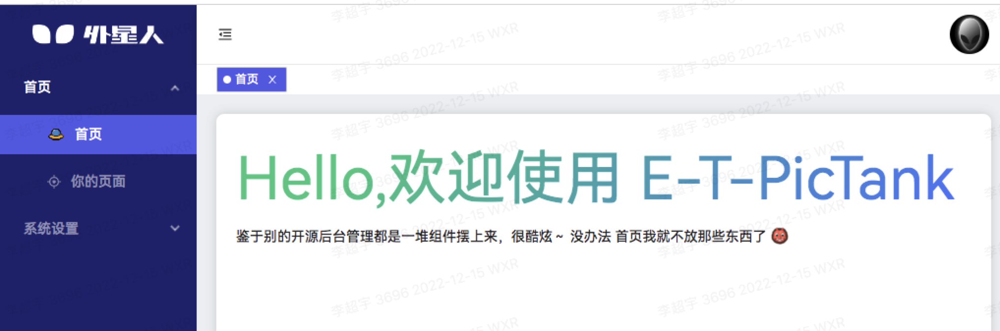

# 快速上手

:tada: E-T-PicTank
框架致力于将复杂的东西简单化，专注于开发业务。
(推荐使用 tsx 开发)

> 框架基于 [vue3.x](https://cn.vuejs.org/) 、 [vite3](https://cn.vitejs.dev/) 、 [antd3.2](https://www.antdv.com/docs/vue/introduce-cn) 、 [pnpm](https://www.pnpm.cn/)、[VueRequest](https://next.attojs.com/) 构建的二次开发框架。内置 TS、Less、prettier、commitlint 代码提交规范...等前端通用插件。

::: tip 提示 :raised_back_of_hand:
在开始之前，推荐学习 [vue3](https://cn.vuejs.org/) 和 [es6](https://es6.ruanyifeng.com/) 相关内容,并正确安装和配置，并请确定安装 Node.js v14.0 或以上。
:::

## 环境准备

首先得有 node，pnpm ,并确保 node 版本是 14 或以上，pnpm 是 7.9 或以上。

```
 $ node -v
 16.18.0
```

```
 $ pnpm -v
 7.9.0
```

## 拉取项目库

先找个地方建个空目录

```
 $ mkdir Alien && cd Aline
```

拉取 ET-web 项目

```
git clone xxxxxx
```

通过官方工具拉取项目所需要的各种库

```
pnpm install
```
## 创建项目

确保最外层有 `Template` 文件夹作为基础模版。

1：pnpm CP <项目名称> 可快速创建项目。

2：进入项目根目录，修改 `packages.json 中 name @app/项目名称` 

## 启动项目

执行 `pnpm start` 命令。
::: warning 注意 :pushpin:
此时会读取 packages 目录下的项目，你可以选择要启动的项目，然后选择要使用的 .env 环境变量。
:::

```
$ pnpm start

? 请选择项目:
❯ EpicTank
  Warehouse
  bulk

? 请选择环境变量文件:
❯ development
  production

➜  Local:   http://localhost:5173/
➜  Network: http://192.168.110.217:5173/
```

在浏览器打开 `http://localhost:5173/`，任意输入账号与密码，可以看到以下界面



## 部署发布

执行 `pnpm build` 命令。

```
$ pnpm build 

? 请选择项目:
❯ EpicTank 
  Warehouse 
  bulk 
```

产物默认会生成到打包项目的 ./dist 目录下。

